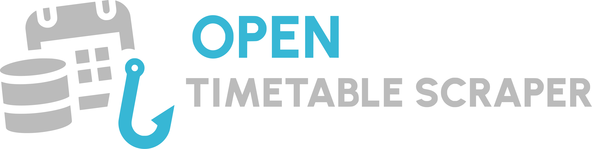

<div align="center">
  
  <h1>@studentsphere/ots-provider-example</h1>
</div>

An example implementation of an Open Timetable Scraper (OTS)

This package serves as a reference and a template for developers who want to build their own timetable scraper providers. It implements a mock provider.

## Installation

```bash
npm install @studentsphere/ots-provider-example
```

---

## How to create your own Provider

Creating a custom provider for StudentSphere is straightforward. All providers must extend the `BaseTimetableProvider` class from the `@studentsphere/ots-core` package.

Here is a step-by-step guide to building your own provider.

### 1. Install the core library

First, you need to install the core package which contains the base class and TypeScript interfaces:

```bash
npm install @studentsphere/ots-core
```

### 2. Create your Provider class

Create a new TypeScript file and extend the `BaseTimetableProvider`. You will need to implement several getters and two main asynchronous methods: `validateCredentials` and `getSchedule`.

```typescript
import {
  BaseTimetableProvider,
  type Course,
  type ProviderCredentials,
  type School,
} from "@studentsphere/ots-core";

export class MyCustomProvider extends BaseTimetableProvider {
  // 1. Define provider metadata
  get id(): string {
    return "my-custom-provider"; // A unique identifier for your provider
  }

  get name(): string {
    return "My Custom Provider"; // The display name
  }

  get logo(): string {
    return "https://example.com/logo.png"; // URL to the provider's logo
  }

  // 2. OPTIONAL: Define supported schools/campuses
  get schools(): School[] {
    return [
      {
        id: "campus-paris",
        name: "Paris Campus",
        logo: "https://example.com/paris.png",
      },
    ];
  }

  // 3. Implement authentication logic
  async validateCredentials(
    credentials: ProviderCredentials
  ): Promise<boolean> {
    try {
      // TODO: Implement your login logic here (e.g., using fetch, axios, or puppeteer)
      // Example:
      // const response = await loginToSchoolPortal(credentials.identifier, credentials.password);
      // return response.isSuccessful;
      
      return credentials.identifier === "student" && credentials.password === "password123";
    } catch (error) {
      return false;
    }
  }

  // 4. Implement scraping logic
  async getSchedule(
    credentials: ProviderCredentials,
    from: Date,
    to: Date
  ): Promise<Course[]> {
    // TODO: Fetch the timetable from the school's portal for the given date range
    // and map the results to the `Course` interface.
    
    const courses: Course[] = [];

    // Example of a mapped course:
    courses.push({
      hash: "unique-course-id-123", // A unique hash to identify this specific course
      subject: "Mathematics",
      start: new Date("2023-10-01T08:00:00"),
      end: new Date("2023-10-01T10:00:00"),
      location: "Room 101",
      teacher: "John Doe",
      color: "#3b82f6", // Optional: Hex color code
    });

    return courses;
  }
}
```

### 3. Method Breakdown

- **`id`**: A unique string identifying your provider (e.g., `provider-wigor`, `provider-celcat`).
- **`name`**: The human-readable name of the provider.
- **`logo`**: A URL pointing to the provider's logo.
- **`schools`**: An array of `School` objects. Some providers handle multiple schools or campuses. If your provider only handles one, just return an array with a single object.
- **`validateCredentials(credentials)`**: This method should attempt to log in to the school's portal using the provided `identifier` and `password`. It must return `true` if the credentials are valid, and `false` otherwise.
- **`getSchedule(credentials, from, to)`**: This is the core of your provider. It must fetch the timetable data between the `from` and `to` dates, parse it, and return an array of `Course` objects.

## License

MIT
